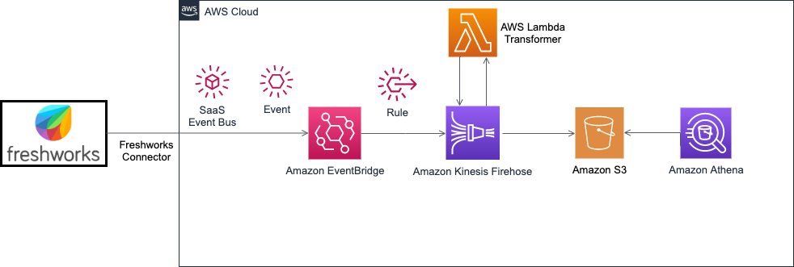

# Amazon EventBridge - Freshdesk event integration example

This example application creates a Kinesis Data Firehose stream, a lambda function and an S3 bucket. It also sets up a custom rule on the event bus to push data to Kinesis Firehose.



Important: this application uses various AWS services and there are costs associated with these services after the Free Tier usage - please see the [AWS Pricing page](https://aws.amazon.com/pricing/) for details. You are responsible for any AWS costs incurred. No warranty is implied in this example.

```bash
.
├── README.MD                   <-- This instructions file
├── lambdaprocessor             <-- Source code for a lambda function
│   └── index.js                <-- Main Lambda handler
├── samtemplate.yaml            <-- SAM template
```

## Requirements

- A Freshdesk account (which can be created [here](https://freshdesk.com/signup)).
- An [AWS Account](https://aws.amazon.com/resources/create-account/)
- AWS Serverless Application Model ([AWS SAM CLI](https://docs.aws.amazon.com/serverless-application-model/latest/developerguide/serverless-sam-cli-install.html)), installed and configured.

## Installation Instructions

1. Create a Freshdesk partner event source by following instructions under Adding the Amazon EventBridge app to a Freshdesk account

2. Create a new directory, navigate to that directory in a terminal and using command line clone the repository: `git clone https://github.com/aws-samples/amazon-eventbridge-freshdesk-example`.

3. From the command line, run:

```
cd ./amazon-eventbridge-freshdesk-example
sam deploy --guided
```

Choose a stack name, input the partner event source name, S3 bucket name for storing event data. SAM CLI tool creates event bus, rule, Lambda function and S3 bucket.

==============================================

Copyright 2020 Amazon.com, Inc. or its affiliates. All Rights Reserved.

SPDX-License-Identifier: MIT-0
